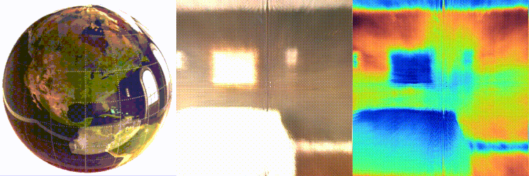

# ORCa: Objects as Radiance-Field Cameras (CVPR 2023)
### [Project Page](https://ktiwary2.github.io/objectsascam/) | [Paper](https://arxiv.org/pdf/2212.04531.pdf) | [Data](https://drive.google.com/file/d/1FvOi_2wfSUnASHulQdBhHQcQCxOuJ8zz/view?usp=sharing)
<br>
Official PyTorch implementation of ORCa: an inverse rendering technique that converts objects in the scene into radiance-field cameras that can be used to image the scene from the scene. ORCa renders the environment as a 5D Radiance Field instead of 2D image. ORCa's advantages are:  
 1) perform beyond field-of-view novel-view synthesis
 2) estimate the environment's radiance field vs. environmnet map
 3) estimate depth from the object to its environment. 

<br>

[ORCa: Objects as Radiance-Field Cameras](https://ktiwary2.github.io/objectsascam/)

 [Kushagra Tiwary*](https://www.media.mit.edu/people/ktiwary/overview/),
 [Akshat Dave*](https://akshadave.github.io),
 [Nikhil Behari](https://www.media.mit.edu/people/nbehari/overview/),
 [Tzofi Klinghoffer](https://tzofi.github.io/),
 [Ashok Veeraraghavan](https://computationalimaging.rice.edu/team/ashok-veeraraghavan/) 
 [Ramesh Raskar](https://web.media.mit.edu/~raskar/) 

 [Camera Culture Lab, MIT Media Lab, MIT](https://www.media.mit.edu/groups/camera-culture/overview/)

accepted for CVPR 2023



## Setting up
### Loading conda environment

Create a new Anaconda environment using the supplied `environment.yml` 
```
conda env create -f environment.yml
```

### Downloading datasets

Unzip [this](https://drive.google.com/drive/folders/1VPth2BHVREkjle7gpfcHmxAxYUzQIzki?usp=share_link) zip file (4.5 GB) into the `data` folder of the repo directory.

Refer to `dataio/Ours.py` and `data/Mitsuba2.py` for pre-processing of real and rendered data respectively.

## Training

Run the following command to train geometry and radiance neural representations from multi-view polarimetric images.
```
python3 train.py --config ./configs/owl.yaml
```
Config files input through `--config` describe the parameters required for training. As an example the parameters for real ceramic owl dataset are described in `real_ceramic_owl.yaml`

Tensorboard logs, checkpoints, arguments and images are saved in the corresponding experiment folder in `logs/`.

## Jupyter Visualizations 

We have included three jupyter notebooks that visualize the conversion from an object to a virtual sensor as described in the paper. 

```
Visualization_virtual_cone.ipynb
```
shows in 2D (flatland) how virtual viewpoint of an arbitrary surface is the intersection of reflected rays eminating from the surface. We show that in the limit as the surface area goes to 0 it is the caustic of the object. More analysis/information in the paper's supplement. 

```
Visualization_virtual_cone_3D.ipynb
```
shows how this notion can be extended in 3D using a sphere instead of a circle. We show our method to calcualte virtual cone and virtual viewpoint. 

```
Visualization_virtual_cone_sphere_case.ipynb
```
puts it all together. This forms the basis of converting objects into radiance-field cameras. 

## Rendering Trained Representations
Using the saved arguments from `config.yaml` and the saved checkpoint such as `latest.pt` in `logs/`, novel views can be rendered using the following command.

```

python3 -m tools.render_view_2b  --config ./configs/owl.yaml --save_videos --save_images --downscale 4 --render_virtual_cam --camera_path train_views --camera_inds 0,2,5,7,10,12,15,17,20,22,25,17,30 --disable_metrics --rayschunk 64 --virual_hfov 100 
 
```

Outputs are saved in the corresponding experiment folder in `out/`. By default,the outputs include surface normal, diffuse radiance, specular radiance and combined radiance for each view along with the estimated roughness.

## Acknowledgements

This repository adapts code or draws inspiration from

- https://akshatdave.github.io/pandora/
- https://github.com/ventusff/neurecon

## Citation

```
@inproceedings{glossyobjects2022,
  title={ORCa: Glossy Objects as Radiance-Field Cameras},
  author={Tiwary, Kushagra and Dave, Akshat and Behari, Nikhil and Klinghoffer, Tzofi and Veeraraghavan, Ashok and Raskar, Ramesh},
  booktitle={ArXiv},
  year={2022}}
```